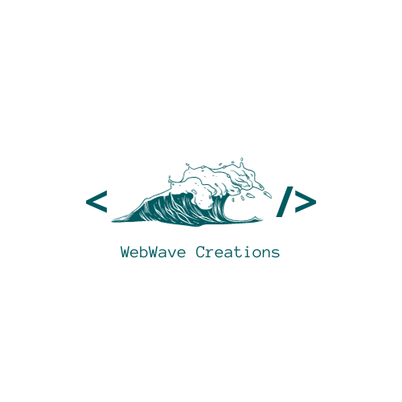

# WWC - WebWave Creations

<p align="center">
<a href= "https://www.fecap.br/"></a>
</p>

# Cem Vezes Mais

## WWC - WebWave Creations

## Integrantes: <a href="https://www.linkedin.com/in/ana-flavia-lor%C3%AAdo-9629b5210?utm_source=share&utm_campaign=share_via&utm_content=profile&utm_medium=ios_app">Ana Flávia Lorêdo</a>,<a href="https://www.linkedin.com/in/eduardo-fraga-santos?utm_source=share&utm_campaign=share_via&utm_content=profile&utm_medium=android_app">Eduardo Fraga</a>, <a href="https://www.linkedin.com/in/gabriel-berto-167475141?utm_source=share&utm_campaign=share_via&utm_content=profile&utm_medium=ios_app">Gabriel Berto</a>, <a href="www.linkedin.com/in/nicolle-costa-a85100211">Nicolle Costa</a>, <a href="">Paulo Carvalho</a>


## Professores Orientadores: <a href="https://www.linkedin.com/in/victorbarq/">Victor Bruno Alexander</a>, <a href="">Adriano Felix Valente</a>, <a href="">Eduardo Savino</a>, <a href="">Aimar Martins Lopes</a>

## Descrição

<p align="center">

-
</p>


O projeto Cem Vezes Mais tem a missão de, por meio do esporte, cultura e educação, ajudar na transformação de vidas e inclusão social de crianças, adolescentes e jovens de comunidades vulneráveis.
<br><br>

## 🛠 Estrutura de pastas

-Raiz<br>
|<br>
|-->documentos<br>
  &emsp;|Documentação.docx<br>
|-->executáveis<br>
  &emsp;|-->windows<br>
|-->imagens<br>
|-->src<br>
  &emsp;|-->Backend<br>
  &emsp;|-->Frontend<br>
|readme.md<br>

<b>documentos</b>: Toda a documentação estará nesta pasta.

<b>executáveis</b>: Binários e executáveis do projeto devem estar nesta pasta.

<b>imagens</b>: Imagens do sistema

<b>src</b>: Pasta que contém o código fonte.

## 🛠 Instalação

<b>Windows:</b>

Não há instalação! Apenas executável!
Encontre o arquivo "app.js" e execute o arquivo no prompt com o comando "node app.js" e verifique que está no diretório do arquivo

```sh
node app.js
```

## 💻 Configuração para Desenvolvimento

Para abrir este projeto você necessita das seguintes ferramentas:

-<a href="https://nodejs.org/en/blog/release/v16.13.0">NODE v16.13.0</a>
-<a href="https://dev.mysql.com/downloads/installer/">MySQL 8.0.34</a>
-<a href="https://docs.docker.com/engine/release-notes/24.0/">Docker v24.0.6</a>

## 🗃 Histórico de lançamentos

A cada atualização os detalhes devem ser lançados aqui.

* 0.0.1 - 09/09/2023
    * ATUALIZAÇÃO: Início do protótipo no figma.
* 0.1.0 - 21/09/2023
    * ATUALIZAÇÃO: Criação de páginas em HTML e CSS.
* 0.1.1 - 20/10/2023
    * ATUALIZAÇÃO: Páginas em HTML e CSS finalizadas e revisadas.
* 0.2.0 - 28/10/2023
    * Início do Back-end
    * MUDANÇA: Remoção de componentes.
* 0.2.1 - 03/11/2023
    * Finalizando Back-end
    * MUDANÇA: Reajuste de componentes.
* 0.3.0 - 10/11/2023
    * Revisão.  
    * Trabalho na reta final.

## 📋 Licença/License


## 🎓 Referências

Aqui estão as referências usadas no projeto.

1. <https://github.com/iuricode/readme-template>
2. <https://github.com/gabrieldejesus/readme-model>
3. <https://creativecommons.org/share-your-work/>
4. <https://freesound.org/>
5. Músicas por: <a href="https://freesound.org/people/DaveJf/sounds/616544/"> DaveJf </a> e <a href="https://freesound.org/people/DRFX/sounds/338986/"> DRFX </a> ambas com Licença CC 0.
